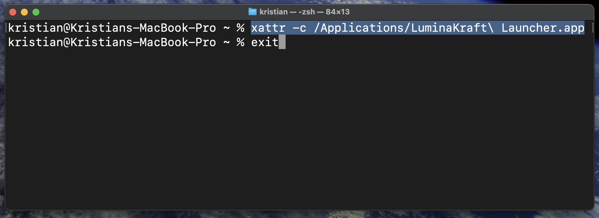

# LuminaKraft Launcher 🚀

[](https://github.com/LuminaKraft/luminakraftlauncher/blob/main/README.md)
[](https://github.com/LuminaKraft/luminakraftlauncher/blob/main/README.es.md)

[](https://github.com/LuminaKraft/luminakraftlauncher/releases)
[](https://github.com/LuminaKraft/luminakraftlauncher/releases/latest)
[](LICENSE)
[](https://github.com/LuminaKraft/luminakraftlauncher/actions)

Un launcher moderno y multiplataforma para Minecraft construido con **Tauri** y **React**, que incluye actualizaciones automáticas, autenticación de Microsoft y gestión de modpacks usando la librería **Lyceris**.


## ✨ Características

- 🔐 **Autenticación de Microsoft**: Inicio de sesión seguro con tu cuenta de Microsoft
- 📦 **Gestión de Modpacks**: Navega e instala modpacks desde CurseForge
- 🔄 **Actualizaciones Automáticas**: Launcher con auto-actualización y gestión de versiones
- 🌍 **Soporte Multi-idioma**: Disponible en inglés y español
- 🖥️ **Multiplataforma**: Soporte nativo para Windows, macOS y Linux
- ⚡ **Interfaz Moderna**: Interfaz hermosa y responsiva construida con React y Tailwind CSS
- 🎮 **Integración con Minecraft**: Potenciado por la librería Lyceris para gestión robusta del juego
- 🔧 **Instalación Fácil**: Instalación y gestión de modpacks con un clic
- 📊 **Seguimiento de Progreso**: Progreso de descarga e instalación en tiempo real
- 🎨 **Temas Personalizados**: Soporte para modo claro y oscuro

## 📸 Capturas de Pantalla

| Interfaz Principal | Características del Launcher | Instalación en macOS |
|:---:|:---:|:---:|
|  |  |  |

## 🎯 Éxito de Compilación Multiplataforma

Todas las plataformas ahora se compilan exitosamente con rendimiento optimizado:

### ✅ Plataformas Soportadas
- **Windows**: Ejecutable `.exe` + instalador NSIS
- **macOS**: Archivos DMG universales (Intel + ARM64) + paquetes `.app`  
- **Linux**: AppImage + paquetes .deb/.rpm + binario

### 📦 Artefactos de Compilación
Todas las salidas de compilación se generan en el directorio `dist/`:
```
dist/
├── LuminaKraft Launcher_0.0.6_x64-setup.exe          # Instalador de Windows
├── LuminaKraft Launcher_0.0.6_x64_portable.exe       # Ejecutable portable de Windows
├── LuminaKraft Launcher_0.0.6_x64.dmg                # DMG de macOS Intel
├── LuminaKraft Launcher_0.0.6_aarch64.dmg            # DMG de macOS ARM64
├── LuminaKraft Launcher_0.0.6_amd64.AppImage         # AppImage de Linux (GUI portable)
├── LuminaKraft Launcher_0.0.6_amd64.deb              # Paquete Debian de Linux
├── LuminaKraft Launcher-0.0.6-1.x86_64.rpm           # Paquete RPM de Linux
└── luminakraft-launcher                              # Binario de Linux
```

## 🚀 Instalación

### 📥 Guía de Instalación Rápida

#### 🪟 **Windows** (Plataforma Recomendada)

1. **Descargar**: Ve a [Versiones](https://github.com/LuminaKraft/luminakraftlauncher/releases/latest) → Descarga `LuminaKraft Launcher_x.x.x_x64-setup.exe`

2. **Ejecutar Instalador**: Haz doble clic en el archivo `.exe` descargado

3. **⚠️ Advertencia de Windows Defender SmartScreen**:
   - Si ves "**Windows protegió tu PC**":
   - Haz clic en "**Más información**"
   - Haz clic en "**Ejecutar de todas formas**"
   - Esto ocurre porque la aplicación aún no está firmada con un certificado costoso

4. **Instalar**: Sigue las instrucciones del instalador → ¡Lanzar!

#### 🍎 **macOS**

1. **Descargar**: 
   - **Macs Intel**: `LuminaKraft Launcher_x.x.x_x64.dmg`
   - **Apple Silicon (M1/M2/M3)**: `LuminaKraft Launcher_x.x.x_aarch64.dmg`

2. **Abrir DMG**: Haz doble clic en el archivo `.dmg` descargado

3. **Arrastrar a Aplicaciones**: Arrastra `LuminaKraft Launcher.app` a la carpeta Aplicaciones
   
   

4. **⚠️ Problemas de Gatekeeper** (Muy Común):
   
   **Si obtienes "La app está dañada" o "No se puede verificar el desarrollador":**
   
   **Método 1 - Clic Derecho (Más Fácil):**
   - Haz clic derecho en la app en Aplicaciones
   - Selecciona "Abrir"
   - Haz clic en "Abrir" cuando se te solicite
   
   **Método 2 - Preferencias del Sistema:**
   - Ve a Menú Apple → Preferencias del Sistema → Seguridad y Privacidad
   - Haz clic en el candado para hacer cambios
   - Encuentra el mensaje de la app bloqueada y haz clic en "Abrir de todas formas"
   
   **Método 3 - Terminal (Si los anteriores fallan):**
   
   Abre Terminal (⌘+Espacio, busca "terminal"):
   
   
   
   Ejecuta este comando:
   ```bash
   # Eliminar atributo de cuarentena
   xattr -cr "/Applications/LuminaKraft Launcher.app"
   ```
   
   

5. **Iniciar el Launcher**: Busca "LuminaKraft Launcher" en Spotlight (⌘+Espacio):

   

#### 🐧 **Linux**

1. **Descargar**: Elige tu formato:
   - **AppImage** (Universal): `LuminaKraft Launcher_x.x.x_amd64.AppImage`
   - **Debian/Ubuntu**: `LuminaKraft Launcher_x.x.x_amd64.deb`
   - **Fedora/RHEL**: `LuminaKraft Launcher-x.x.x-1.x86_64.rpm`

2. **Instalar**:
   ```bash
   # AppImage (No requiere instalación)
   chmod +x LuminaKraft\ Launcher_*_amd64.AppImage
   ./LuminaKraft\ Launcher_*_amd64.AppImage
   
   # Debian/Ubuntu
   sudo dpkg -i LuminaKraft\ Launcher_*_amd64.deb
   
   # Fedora/RHEL  
   sudo rpm -i LuminaKraft\ Launcher-*-1.x86_64.rpm
   ```

### 📋 Requisitos del Sistema
- **Windows**: Windows 10 o posterior
- **macOS**: macOS 10.13 (High Sierra) o posterior
- **Linux**: Distribución moderna con GTK 3.24+
- **RAM**: 4GB mínimo, 8GB recomendado
- **Almacenamiento**: 1GB de espacio libre para el launcher + almacenamiento de modpacks

### 🔧 Solución de Problemas

#### Problemas en Windows
- **Advertencia SmartScreen**: Comportamiento normal, haz clic en "Más información" → "Ejecutar de todas formas"
- **Detección de Antivirus**: Agrega el launcher a la lista blanca del antivirus
- **Instalación Fallida**: Ejecuta el instalador como Administrador

#### Problemas en macOS  
- **"La app está dañada"**: Elimina la cuarentena con `xattr -cr "/Applications/LuminaKraft Launcher.app"` ([ver guía visual](#️-problemas-de-gatekeeper-muy-común))
- **"No se puede verificar el desarrollador"**: Clic derecho en la app → Abrir → Abrir ([ver guía de instalación](#-macos))
- **Permiso Denegado**: Revisa la configuración de Seguridad y Privacidad
- **La app no se inicia**: Intenta abrir desde Terminal: `open "/Applications/LuminaKraft Launcher.app"`

#### Problemas en Linux
- **AppImage no se ejecuta**: Hazlo ejecutable con `chmod +x`
- **Dependencias faltantes**: Instala GTK 3.24+ y WebKit2GTK
- **Conflictos de paquetes**: Usa AppImage para compatibilidad universal

## 🛠 Compilación desde el Código Fuente

### Requisitos Previos
- **Node.js** 20+ y npm
- **Rust** 1.82.0+
- **Docker** (para compilación cruzada de Windows/Linux en macOS)

### Comandos de Compilación Rápida

```bash
# Clonar el repositorio
git clone https://github.com/LuminaKraft/luminakraftlauncher.git
cd luminakraftlauncher

# Instalar dependencias
npm install

# Compilar solo para la plataforma actual
npm run tauri build

# Compilar todas las plataformas (modo rápido - recomendado para desarrollo)
bash scripts/build-all.sh all

# Compilar todas las plataformas (con limpieza de Docker - para primera compilación o CI)
bash scripts/build-all.sh all --clean-docker

# Compilar plataformas específicas
bash scripts/build-macos.sh    # macOS (Intel + ARM64)
bash scripts/build-windows.sh  # Windows (vía Docker)
bash scripts/build-linux.sh    # Linux AppImage (vía Docker)
```

### 🚀 Rendimiento de Compilación

- **Modo Rápido**: Omite la limpieza de Docker para compilaciones subsecuentes 2-3x más rápidas
- **Modo Confiable**: Limpieza completa de Docker para máxima compatibilidad
- **Optimizado en Memoria**: Usa 6GB máx de memoria con límites de 2 núcleos
- **Compilaciones Secuenciales**: Previene conflictos de memoria entre plataformas

## 📋 Desarrollo

### Desarrollo Local
```bash
# Instalar dependencias
npm install

# Iniciar servidor de desarrollo
npm run tauri:dev

# Ejecutar con puerto estable (mata el puerto 1420 primero)
npm run tauri:dev-stable

# Verificar código
npm run lint

# Limpiar artefactos de compilación
npm run clean
```

### Estructura del Proyecto
```
luminakraft-launcher/
├── src/                    # Código fuente del frontend React
│   ├── components/         # Componentes de UI
│   ├── services/          # Capas de API y servicios
│   ├── types/             # Definiciones de tipos TypeScript
│   ├── contexts/          # Contextos de React
│   ├── locales/           # Archivos de internacionalización
│   └── assets/            # Recursos estáticos
├── src-tauri/             # Código fuente del backend Tauri
│   ├── src/               # Archivos fuente de Rust
│   ├── Cargo.toml         # Dependencias de Rust
│   └── tauri.conf.json    # Configuración de Tauri
├── public/                # Recursos públicos estáticos
├── scripts/               # Scripts de compilación y utilidades
├── docs/                  # Documentación
└── assets/                # Capturas de pantalla e imágenes
```

## 🔧 Detalles Técnicos

### Arquitectura
- **Frontend**: React 18 + TypeScript + Vite + Tailwind CSS
- **Backend**: Rust + Tauri 2.5.1
- **Compilación cruzada**: Docker + cadenas de herramientas MinGW/GNU
- **Empaquetado**: Instaladores nativos + AppImage para Linux
- **Librería de Minecraft**: Lyceris para autenticación y gestión del juego
- **Iconos de UI**: Lucide React para iconografía moderna
- **Cliente HTTP**: Axios (frontend) + Reqwest (backend)

### Librerías Clave
- **Lyceris**: Funcionalidad central del launcher de Minecraft
- **Tauri**: Framework de aplicaciones multiplataforma
- **React**: Framework de frontend
- **Tailwind CSS**: Estilizado utility-first
- **i18next**: Internacionalización
- **Lucide React**: Librería de iconos

### Optimización de Memoria
- Contenedores Docker limitados a 6GB RAM, 2 núcleos de CPU
- Compilación de Rust optimizada para eficiencia de memoria
- Compilaciones incrementales para iteración más rápida

## 🌍 Internacionalización

LuminaKraft Launcher soporta múltiples idiomas:
- **Inglés** (en) - Por defecto
- **Español** (es) - Español

Para contribuir con traducciones:
1. Revisa el directorio `src/locales/`
2. Agrega o actualiza archivos de traducción
3. Sigue la estructura de claves existente
4. Envía un pull request

## 📚 Documentación

- [Guía Completa de Compilación](docs/BUILD_SUCCESS_SUMMARY.md) - Documentación completa de compilación
- [Optimización de Memoria](docs/MEMORY_OPTIMIZATION_GUIDE.md) - Detalles de ajuste de rendimiento
- [Éxito de Compilación en Windows](docs/WINDOWS_BUILD_SUCCESS.md) - Soluciones específicas para Windows
- [Guía de Compilación Cruzada](docs/CROSS_COMPILATION_GUIDE.md) - Compilación multiplataforma
- [Pautas de Contribución](CONTRIBUTING.md) - Cómo contribuir al proyecto
- [Código de Conducta](CODE_OF_CONDUCT.md) - Pautas de la comunidad

## 🤝 Contribuciones

¡Damos la bienvenida a las contribuciones! Por favor revisa nuestras [Pautas de Contribución](CONTRIBUTING.md) para más detalles.

### Inicio Rápido para Contribuidores
1. Haz un fork del repositorio
2. Crea una rama de feature (`git checkout -b feature/caracteristica-increible`)
3. Haz tus cambios siguiendo nuestras [pautas de estilo de código](CONTRIBUTING.md#code-style-and-formatting)
4. Prueba las compilaciones en tu plataforma objetivo
5. Confirma tus cambios (`git commit -s -m 'Agregar característica increíble'`)
6. Push a la rama (`git push origin feature/caracteristica-increible`)
7. Abre un Pull Request

### Entorno de Desarrollo
- Sigue nuestro [Código de Conducta](CODE_OF_CONDUCT.md)
- Firma tus commits ([Certificado de Origen del Desarrollador](CONTRIBUTING.md#signing-your-work))
- Usa mensajes de commit convencionales
- Prueba en múltiples plataformas cuando sea posible

## 🐛 Reportes de Errores y Solicitudes de Características

¿Encontraste un error o tienes una solicitud de característica? Por favor revisa nuestra [página de Issues](https://github.com/LuminaKraft/luminakraft-launcher/issues) y crea un nuevo issue si es necesario.

## 📄 Licencia

Este proyecto está licenciado bajo la **Licencia Pública General GNU v3.0** - revisa el archivo [LICENSE](LICENSE) para más detalles.

### Licencias de Terceros
Revisa [COPYING.md](COPYING.md) para información detallada sobre dependencias de terceros y sus licencias.

## 🏆 Reconocimientos

- **Librería Lyceris**: Funcionalidad central del launcher de Minecraft
- **Equipo Tauri**: Framework multiplataforma increíble
- **Comunidad React**: Excelente ecosistema de frontend
- **Prism Launcher**: Inspiración para las pautas de la comunidad
- **Todos los Contribuidores**: ¡Gracias por hacer este proyecto mejor!

## 📞 Soporte

- 📖 **Documentación**: Revisa nuestro directorio [docs](docs/)
- 🐛 **Reportes de Errores**: [GitHub Issues](https://github.com/LuminaKraft/luminakraft-launcher/issues)
- 💬 **Discusiones**: [GitHub Discussions](https://github.com/LuminaKraft/luminakraft-launcher/discussions)
- 🌐 **Sitio Web**: ¡Próximamente!

---

**🎉 ¡Listo para distribución multiplataforma!** LuminaKraft Launcher se compila exitosamente para Windows, macOS y Linux con rendimiento optimizado y procesos de compilación automatizados.

<div align="center">
  <sub>Construido con ❤️ por el equipo de LuminaKraft Studios</sub>
</div> 