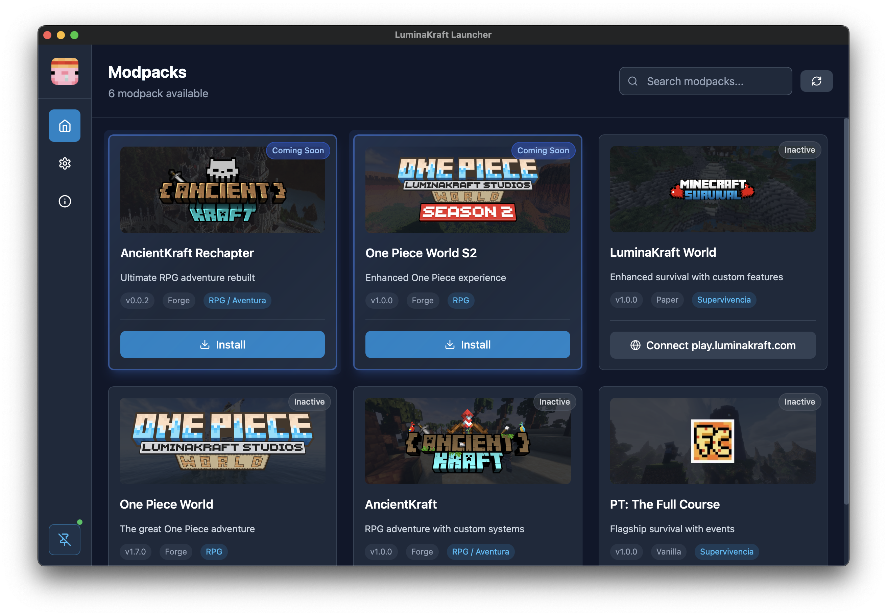
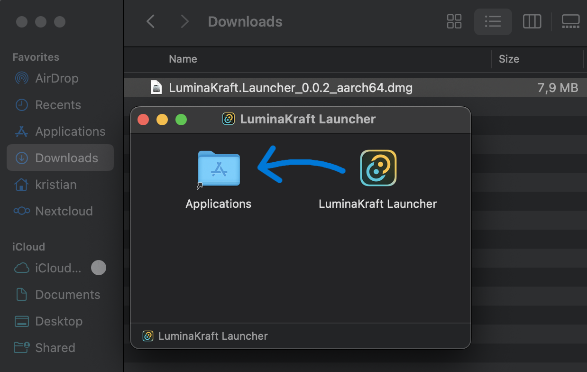
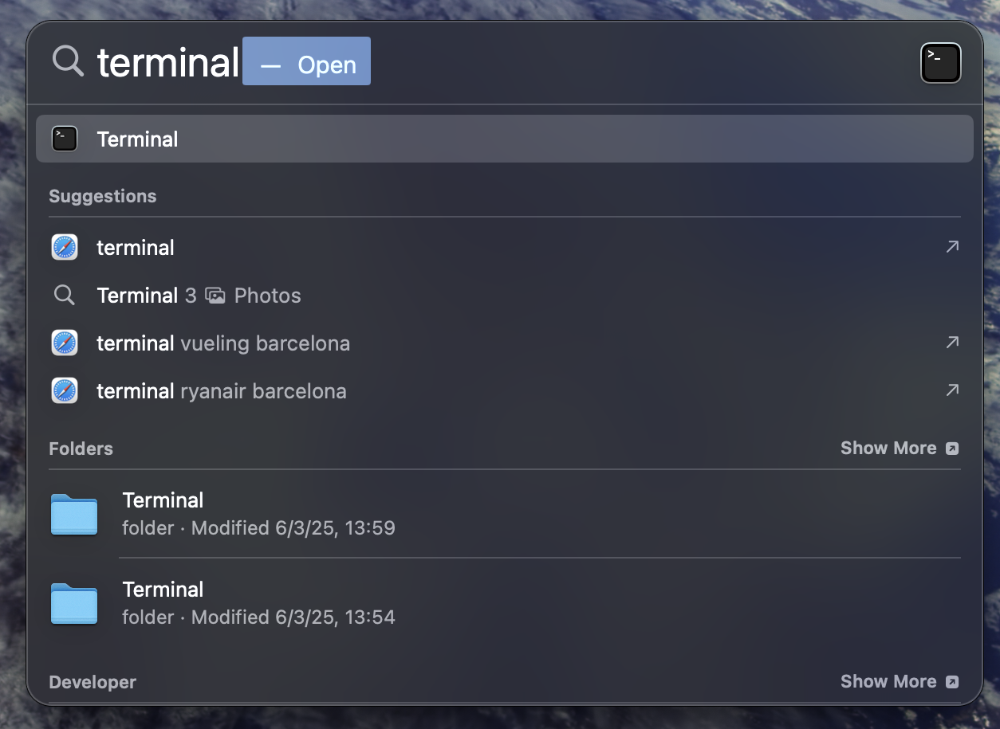
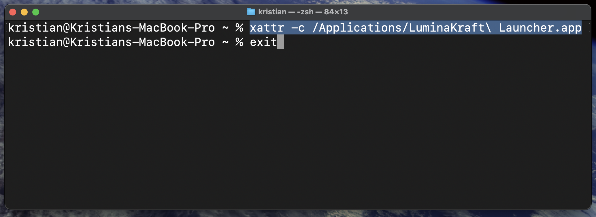
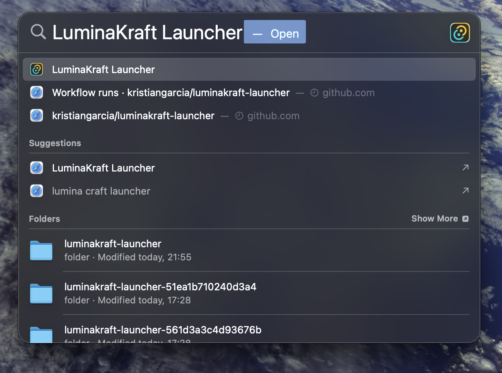

# LuminaKraft Launcher 💎

[](https://github.com/LuminaKraft/luminakraftlauncher/blob/main/README.md)
[](https://github.com/LuminaKraft/luminakraftlauncher/blob/main/README.es.md)

[](https://github.com/LuminaKraft/luminakraftlauncher/releases)
[](https://github.com/LuminaKraft/luminakraftlauncher/releases/latest)
[](LICENSE)
[](https://github.com/LuminaKraft/luminakraftlauncher/actions)

A modern, cross-platform Minecraft launcher built with **Tauri** and **React**, featuring automatic updates, Microsoft authentication, and modpack management using the **Lyceris** library.



## ✨ Features

- 🔐 **Microsoft Authentication**: Secure login with your Microsoft account
- 📦 **Modpack Management**: Browse and install modpacks from CurseForge
- 🔄 **Automatic Updates**: Self-updating launcher with seamless version management
- 🌍 **Multi-language Support**: Available in English and Spanish
- 🖥️ **Cross-Platform**: Native support for Windows, macOS, and Linux
- ⚡ **Modern UI**: Beautiful, responsive interface built with React and Tailwind CSS
- 🎮 **Minecraft Integration**: Powered by the Lyceris library for robust game management
- 🔧 **Easy Installation**: One-click modpack installation and management
- 📊 **Progress Tracking**: Real-time download and installation progress
- 🎨 **Custom Themes**: Light and dark mode support

## 📸 Screenshots

| Main Interface | Launcher Features | macOS Installation |
|:---:|:---:|:---:|
|  |  |  |

## 🎯 Cross-Platform Build Success

All platforms now build successfully with optimized performance:

### ✅ Supported Platforms
- **Windows**: `.exe` executable + NSIS installer
- **macOS**: Universal DMG files (Intel + ARM64) + `.app` bundles  
- **Linux**: AppImage + .deb/.rpm packages + binary

### 📦 Build Artifacts
All build outputs are generated in the `dist/` directory:
```
dist/
├── LuminaKraft Launcher_0.0.6_x64-setup.exe          # Windows installer
├── LuminaKraft Launcher_0.0.6_x64_portable.exe       # Windows portable executable
├── LuminaKraft Launcher_0.0.6_x64.dmg                # macOS Intel DMG
├── LuminaKraft Launcher_0.0.6_aarch64.dmg            # macOS ARM64 DMG
├── LuminaKraft Launcher_0.0.6_amd64.AppImage         # Linux AppImage (portable GUI)
├── LuminaKraft Launcher_0.0.6_amd64.deb              # Linux Debian package
├── LuminaKraft Launcher-0.0.6-1.x86_64.rpm           # Linux RPM package
└── luminakraft-launcher                              # Linux binary
```

## 🚀 Installation

### 📥 Quick Installation Guide

#### 🪟 **Windows** (Recommended Platform)

1. **Download**: Go to [Releases](https://github.com/LuminaKraft/luminakraftlauncher/releases/latest) → Download `LuminaKraft Launcher_x.x.x_x64-setup.exe`

2. **Run Installer**: Double-click the downloaded `.exe` file

3. **⚠️ Windows Defender SmartScreen Warning**:
   - If you see "**Windows protected your PC**":
   - Click "**More info**"
   - Click "**Run anyway**"
   - This happens because the app isn't signed with an expensive certificate yet

4. **Install**: Follow the installer prompts → Launch!

#### 🍎 **macOS**

1. **Download**: 
   - **Intel Macs**: `LuminaKraft Launcher_x.x.x_x64.dmg`
   - **Apple Silicon (M1/M2/M3)**: `LuminaKraft Launcher_x.x.x_aarch64.dmg`

2. **Open DMG**: Double-click the downloaded `.dmg` file

3. **Drag to Applications**: Drag `LuminaKraft Launcher.app` to Applications folder
   
   

4. **⚠️ Gatekeeper Issues** (Very Common):
   
   **If you get "App is damaged" or "Cannot verify developer":**
   
   **Method 1 - Right Click (Easiest):**
   - Right-click the app in Applications
   - Select "Open" 
   - Click "Open" when prompted
   
   **Method 2 - System Preferences:**
   - Go to Apple Menu → System Preferences → Security & Privacy
   - Click the lock to make changes
   - Find the blocked app message and click "Open Anyway"
   
   **Method 3 - Terminal (If above fail):**
   
   Open Terminal (⌘+Space, search "terminal"):
   
   
   
   Run this command:
   ```bash
   # Remove quarantine attribute
   xattr -cr "/Applications/LuminaKraft Launcher.app"
   ```
   
   

5. **Launch the Launcher**: Search for "LuminaKraft Launcher" in Spotlight (⌘+Space):

   

#### 🐧 **Linux**

1. **Download**: Choose your format:
   - **AppImage** (Universal): `LuminaKraft Launcher_x.x.x_amd64.AppImage`
   - **Debian/Ubuntu**: `LuminaKraft Launcher_x.x.x_amd64.deb`
   - **Fedora/RHEL**: `LuminaKraft Launcher-x.x.x-1.x86_64.rpm`

2. **Install**:
   ```bash
   # AppImage (No installation needed)
   chmod +x LuminaKraft\ Launcher_*_amd64.AppImage
   ./LuminaKraft\ Launcher_*_amd64.AppImage
   
   # Debian/Ubuntu
   sudo dpkg -i LuminaKraft\ Launcher_*_amd64.deb
   
   # Fedora/RHEL  
   sudo rpm -i LuminaKraft\ Launcher-*-1.x86_64.rpm
   ```

### 📋 System Requirements
- **Windows**: Windows 10 or later
- **macOS**: macOS 10.13 (High Sierra) or later
- **Linux**: Modern distribution with GTK 3.24+
- **RAM**: 4GB minimum, 8GB recommended
- **Storage**: 1GB free space for launcher + modpack storage

### 🔧 Troubleshooting

#### Windows Issues
- **SmartScreen Warning**: Normal behavior, click "More info" → "Run anyway"
- **Antivirus Detection**: Add launcher to antivirus whitelist
- **Installation Failed**: Run installer as Administrator

#### macOS Issues  
- **"App is damaged"**: Remove quarantine with `xattr -cr "/Applications/LuminaKraft Launcher.app"` ([see visual guide](#️-gatekeeper-issues-very-common))
- **"Cannot verify developer"**: Right-click app → Open → Open ([see installation guide](#-macos))
- **Permission Denied**: Check Security & Privacy settings
- **App won't launch**: Try opening from Terminal: `open "/Applications/LuminaKraft Launcher.app"`

#### Linux Issues
- **AppImage won't run**: Make executable with `chmod +x`
- **Missing dependencies**: Install GTK 3.24+ and WebKit2GTK
- **Package conflicts**: Use AppImage for universal compatibility

## 🛠 Building from Source

### Prerequisites
- **Node.js** 20+ and npm
- **Rust** 1.82.0+
- **Docker** (for Windows/Linux cross-compilation on macOS)

### Quick Build Commands

```bash
# Clone the repository
git clone https://github.com/LuminaKraft/luminakraftlauncher.git
cd luminakraftlauncher

# Install dependencies
npm install

# Build for current platform only
npm run tauri build

# Build all platforms (fast mode - recommended for development)
bash scripts/build-all.sh all

# Build all platforms (with Docker cleanup - for first build or CI)
bash scripts/build-all.sh all --clean-docker

# Build specific platforms
bash scripts/build-macos.sh    # macOS (Intel + ARM64)
bash scripts/build-windows.sh  # Windows (via Docker)
bash scripts/build-linux.sh    # Linux AppImage (via Docker)
```

### 🚀 Build Performance

- **Fast Mode**: Skip Docker cleanup for 2-3x faster subsequent builds
- **Reliable Mode**: Full Docker cleanup for maximum compatibility
- **Memory Optimized**: Uses 6GB max memory with 2-core limits
- **Sequential Builds**: Prevents memory conflicts between platforms

## 📋 Development

### Local Development
```bash
# Install dependencies
npm install

# Start development server
npm run tauri:dev

# Run with stable port (kills port 1420 first)
npm run tauri:dev-stable

# Lint code
npm run lint

# Clean build artifacts
npm run clean
```

### Project Structure
```
luminakraft-launcher/
├── src/                    # React frontend source code
│   ├── components/         # UI components
│   ├── services/          # API and service layers
│   ├── types/             # TypeScript type definitions
│   ├── contexts/          # React contexts
│   ├── locales/           # Internationalization files
│   └── assets/            # Static assets
├── src-tauri/             # Tauri backend source code
│   ├── src/               # Rust source files
│   ├── Cargo.toml         # Rust dependencies
│   └── tauri.conf.json    # Tauri configuration
├── public/                # Static public assets
├── scripts/               # Build and utility scripts
├── docs/                  # Documentation
└── assets/                # Screenshots and images
```

## 🔧 Technical Details

### Architecture
- **Frontend**: React 18 + TypeScript + Vite + Tailwind CSS
- **Backend**: Rust + Tauri 2.5.1
- **Cross-compilation**: Docker + MinGW/GNU toolchains
- **Packaging**: Native installers + AppImage for Linux
- **Minecraft Library**: Lyceris for authentication and game management
- **UI Icons**: Lucide React for modern iconography
- **HTTP Client**: Axios (frontend) + Reqwest (backend)

### Key Libraries
- **Lyceris**: Minecraft launcher core functionality
- **Tauri**: Cross-platform app framework
- **React**: Frontend framework
- **Tailwind CSS**: Utility-first styling
- **i18next**: Internationalization
- **Lucide React**: Icon library

### Memory Optimization
- Docker containers limited to 6GB RAM, 2 CPU cores
- Rust compilation optimized for memory efficiency
- Incremental builds for faster iteration

## 🌍 Internationalization

LuminaKraft Launcher supports multiple languages:
- **English** (en) - Default
- **Spanish** (es) - Español

To contribute translations:
1. Check the `src/locales/` directory
2. Add or update translation files
3. Follow the existing key structure
4. Submit a pull request

## 📚 Documentation

- [Complete Build Guide](docs/BUILD_SUCCESS_SUMMARY.md) - Comprehensive build documentation
- [Memory Optimization](docs/MEMORY_OPTIMIZATION_GUIDE.md) - Performance tuning details
- [Windows Build Success](docs/WINDOWS_BUILD_SUCCESS.md) - Windows-specific solutions
- [Cross Compilation Guide](docs/CROSS_COMPILATION_GUIDE.md) - Multi-platform building
- [Contributing Guidelines](CONTRIBUTING.md) - How to contribute to the project
- [Code of Conduct](CODE_OF_CONDUCT.md) - Community guidelines

## 🤝 Contributing

We welcome contributions! Please see our [Contributing Guidelines](CONTRIBUTING.md) for details.

### Quick Start for Contributors
1. Fork the repository
2. Create a feature branch (`git checkout -b feature/amazing-feature`)
3. Make your changes following our [code style guidelines](CONTRIBUTING.md#code-style-and-formatting)
4. Test builds on your target platform
5. Commit your changes (`git commit -s -m 'Add amazing feature'`)
6. Push to the branch (`git push origin feature/amazing-feature`)
7. Open a Pull Request

### Development Environment
- Follow our [Code of Conduct](CODE_OF_CONDUCT.md)
- Sign off your commits ([Developer Certificate of Origin](CONTRIBUTING.md#signing-your-work))
- Use conventional commit messages
- Test on multiple platforms when possible

## 🐛 Bug Reports & Feature Requests

Found a bug or have a feature request? Please check our [Issues page](https://github.com/LuminaKraft/luminakraft-launcher/issues) and create a new issue if needed.

## 📄 License

This project is licensed under the **GNU General Public License v3.0** - see the [LICENSE](LICENSE) file for details.

### Third-Party Licenses
See [COPYING.md](COPYING.md) for detailed information about third-party dependencies and their licenses.

## 🏆 Acknowledgments

- **Lyceris Library**: Core Minecraft launcher functionality
- **Tauri Team**: Amazing cross-platform framework
- **React Community**: Excellent frontend ecosystem
- **Prism Launcher**: Inspiration for community guidelines
- **All Contributors**: Thank you for making this project better!

## 📞 Support

- 📖 **Documentation**: Check our [docs](docs/) directory
- 🐛 **Bug Reports**: [GitHub Issues](https://github.com/LuminaKraft/luminakraft-launcher/issues)
- 💬 **Discussions**: [GitHub Discussions](https://github.com/LuminaKraft/luminakraft-launcher/discussions)
- 🌐 **Website**: Coming soon!

---

**🎉 Ready for multi-platform distribution!** LuminaKraft Launcher successfully builds for Windows, macOS, and Linux with optimized performance and automated build processes.

<div align="center">
  <sub>Built with ❤️ by the LuminaKraft Studios team</sub>
</div>
