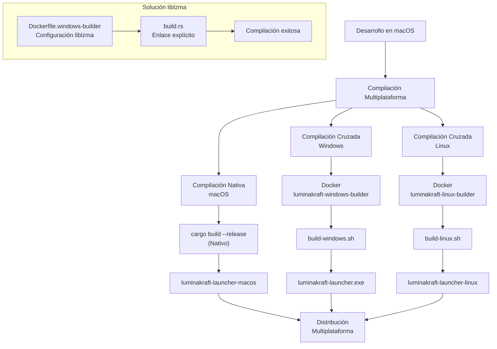

# Flujo de Trabajo de Compilación Cruzada

Este diagrama muestra el proceso de compilación multiplataforma para el LuminaKraft Launcher.

## Descripción del Flujo

1. **Desarrollo en macOS**: El desarrollo principal se realiza en macOS.

2. **Compilación Multiplataforma**: Se utiliza un enfoque de compilación multiplataforma para generar ejecutables para todas las plataformas soportadas.

3. **Compilación Nativa (macOS)**: 
   - Se utiliza `cargo build --release` directamente en macOS.
   - Produce `luminakraft-launcher-macos`.

4. **Compilación Cruzada (Windows)**:
   - Se utiliza Docker con la imagen `luminakraft-windows-builder`.
   - El script `build-windows.sh` gestiona el proceso de compilación.
   - Produce `luminakraft-launcher.exe`.
   - Incluye la solución específica para el problema de enlace con liblzma.

5. **Compilación Cruzada (Linux)**:
   - Se utiliza Docker con la imagen `luminakraft-linux-builder`.
   - El script `build-linux.sh` gestiona el proceso de compilación.
   - Produce `luminakraft-launcher-linux`.

6. **Distribución Multiplataforma**: Todos los ejecutables se recopilan para su distribución.

7. **Solución liblzma**: Componentes específicos para resolver el problema de enlace con liblzma:
   - Configuración en `Dockerfile.windows-builder` para instalar y configurar liblzma.
   - Modificaciones en `build.rs` para proporcionar instrucciones de enlace explícitas.

## Uso del Flujo

Para utilizar este flujo de trabajo, ejecuta el script `build-all.sh` que automatiza todo el proceso de compilación multiplataforma. 