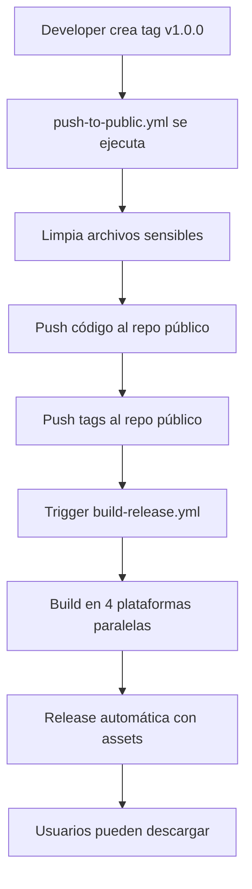
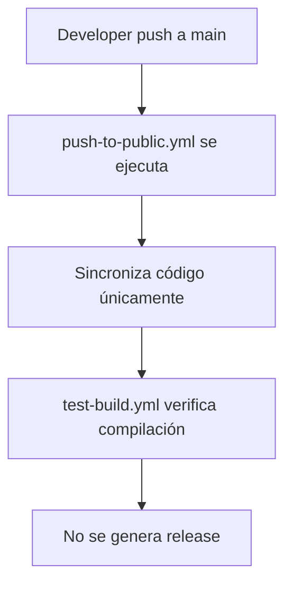
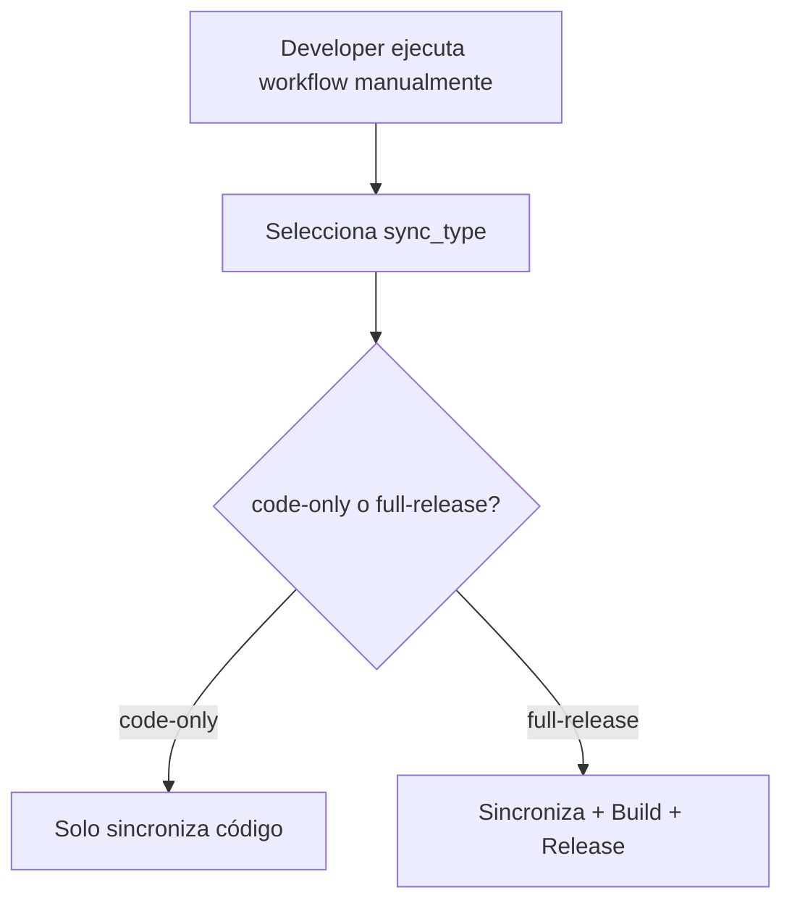

# 🔄 Solución Híbrida: Desarrollo Privado + Releases Públicas

Esta solución híbrida permite mantener el código fuente en un repositorio **privado** mientras se aprovechan los **minutos gratuitos ilimitados** de GitHub Actions en un repositorio **público** para las builds y releases.

## 🏗️ Arquitectura

```
┌─────────────────────────────────────┐    ┌──────────────────────────────────────┐
│        REPOSITORIO PRIVADO          │    │         REPOSITORIO PÚBLICO          │
│   kristiangarcia/luminakraft-       │    │  kristiangarcia/luminakraft-        │
│          launcher                   │    │       launcher-releases             │
├─────────────────────────────────────┤    ├──────────────────────────────────────┤
│ ✅ Código fuente completo          │    │ ✅ Solo releases y assets           │
│ ✅ Commits y historial privado     │────▶│ ✅ Builds automáticas GRATUITAS    │
│ ✅ Desarrollo seguro               │    │ ✅ Descargas públicas              │
│ ✅ Configuración sensible          │    │ ✅ Issues y feedback de usuarios   │
│ ⚡ Push automático al público      │    │ ⚡ GitHub Actions ilimitadas       │
└─────────────────────────────────────┘    └──────────────────────────────────────┘
```

## 💰 Beneficios

### 🔒 **Seguridad**
- Código fuente permanece **privado**
- Secretos y configuraciones sensibles protegidas
- Control total sobre el desarrollo

### 💸 **Costos**
- **0 minutos de GitHub Actions gastados** en el repo privado
- Minutos **ilimitados y gratuitos** en el repo público
- Ahorro significativo en proyectos grandes

### 🚀 **Eficiencia**
- Builds paralelas en múltiples plataformas
- Releases automáticas con assets completos
- Sistema de actualizaciones automáticas

### 👥 **Comunidad**
- Los usuarios pueden reportar issues en el repo público
- Descargas visibles y estadísticas públicas
- Transparencia en releases sin exponer código

## 🔧 Configuración

### 1. **Repositorio Privado** (`luminakraft-launcher`)

#### Secrets Requeridos:
```bash
PUBLIC_REPO_TOKEN    # Token con permisos en el repo público
TAURI_PRIVATE_KEY    # Clave privada para firmar releases
TAURI_KEY_PASSWORD   # Password de la clave privada
```

#### Workflows:
- `push-to-public.yml`: Sincroniza código al repo público
- `test-release-fast.yml`: Testing rápido sin releases

### 2. **Repositorio Público** (`luminakraft-launcher-releases`)

#### Secrets Requeridos:
```bash
TAURI_PRIVATE_KEY    # Clave privada para firmar releases
TAURI_KEY_PASSWORD   # Password de la clave privada
```

#### Workflows:
- `build-release.yml`: Build completo y release automático
- `test-build.yml`: Testing de compilación sin release

## 🔄 Flujo de Trabajo

### 🏷️ **Release Completa** (Tag)



### 🔄 **Desarrollo Continuo** (Push a main)



### 🧪 **Testing Manual**



## 🚀 Comandos y Uso

### **En el Repositorio Privado:**

#### 1. Sincronizar solo código:
```bash
# Automático al hacer push a main
git push origin main
```

#### 2. Release completa:
```bash
# Crear y push tag
git tag v1.0.0
git push origin v1.0.0
```

#### 3. Testing manual:
- Ve a **Actions** → **Push to Public Repository**
- Clic en **Run workflow**
- Selecciona opciones y ejecuta

### **En el Repositorio Público:**

#### 1. Build manual:
- Ve a **Actions** → **Build and Release**
- Clic en **Run workflow**
- Ingresa tag name (ej: `v1.0.0`)

#### 2. Test de compilación:
- Se ejecuta automáticamente en cada push
- También disponible manualmente en Actions

## 📁 Estructura de Archivos

### **Archivos Excluidos del Repo Público:**
- `.env*` - Variables de entorno
- `*.key`, `*.pem` - Claves privadas
- `secrets/`, `private/` - Directorios sensibles
- `.vscode/settings.json` - Configuración personal
- `PRIVATE_*`, `INTERNAL_*` - Archivos internos

### **Archivos Sincronizados:**
- Todo el código fuente (`src/`, `src-tauri/`)
- Configuración de build (`package.json`, `Cargo.toml`)
- Assets públicos (`public/`, `icons/`)
- Documentación pública (`README.md`, `LICENSE`)

## 🛠️ Mantenimiento

### **Actualizar Secrets:**
1. **Repo Privado**: Settings → Secrets → Actions
2. **Repo Público**: Settings → Secrets → Actions
3. Asegurar que `TAURI_PRIVATE_KEY` y `TAURI_KEY_PASSWORD` sean idénticos

### **Troubleshooting:**

#### ❌ "Failed to trigger build workflow"
```bash
# Verificar que el workflow existe en el repo público
curl -H "Authorization: token $TOKEN" \
     https://api.github.com/repos/kristiangarcia/luminakraft-launcher-releases/actions/workflows
```

#### ❌ Push falló por conflictos
```bash
# Usar force push (cuidado: sobrescribe historial)
# En GitHub Actions: ejecutar workflow con force_push: true
```

#### ❌ Build falló por dependencias
```bash
# Verificar que package.json y Cargo.toml estén sincronizados
# Revisar logs en el repo público → Actions
```

## 📊 Monitoreo

### **Métricas a Supervisar:**
- ✅ **Sync Success Rate**: % de syncs exitosos
- ⏱️ **Build Time**: Tiempo promedio de builds
- 📦 **Release Size**: Tamaño de assets generados
- 🔄 **Sync Frequency**: Frecuencia de sincronizaciones

### **Alertas Configuradas:**
- 🚨 Fallo en sync automático
- ⚠️ Build time > 30 minutos
- 📧 Release draft generada (notificación)

## 🔮 Mejoras Futuras

### **Próximas Funcionalidades:**
- 🔄 **Sync Bidireccional**: Issues del público al privado
- 📊 **Dashboard**: Panel de control de releases
- 🧪 **Preview Builds**: Builds automáticas de PRs
- 🔐 **Enhanced Security**: Verificación adicional de archivos

### **Optimizaciones Planeadas:**
- ⚡ **Incremental Sync**: Solo cambios modificados
- 🗃️ **Artifact Caching**: Cache entre builds
- 🎯 **Selective Builds**: Solo plataformas específicas
- 📈 **Analytics**: Métricas de descargas y uso

---

## 🎯 Resultado Final

Con esta solución híbrida obtienes:

✅ **Código fuente privado y seguro**  
✅ **Builds gratuitas e ilimitadas**  
✅ **Releases automáticas multiplataforma**  
✅ **Comunidad activa en repo público**  
✅ **Cero costos en GitHub Actions**  
✅ **Máxima flexibilidad de desarrollo**

**🚀 ¡La solución perfecta para proyectos comerciales que quieren aprovechar lo mejor de ambos mundos!** 