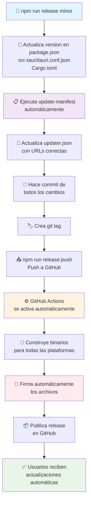

# 🚀 Flujo de Trabajo de Releases

Este documento describe el flujo automatizado completo para crear releases de LuminaKraft Launcher.

## 📊 Diagrama del Flujo de Trabajo



## 🎯 Comandos Disponibles

### Releases Estables
```bash
npm run release patch    # 0.0.8 → 0.0.9
npm run release minor    # 0.0.8 → 0.1.0  
npm run release major    # 0.0.8 → 1.0.0
```

### Releases Experimentales
```bash
npm run release -- 0.0.8-alpha.3    # Versión alpha específica
npm run release -- 0.0.8-beta.1     # Versión beta específica
npm run release -- 0.0.8-rc.1       # Release candidate
```

### Push y Activación
```bash
npm run release:push     # Push commits y tags para activar GitHub Actions
```

## 🔄 Proceso Automatizado

### 1. **Preparación del Release** (Local)
- ✅ Actualiza versiones en todos los archivos de configuración
- ✅ Ejecuta `update-manifest` automáticamente
- ✅ Actualiza `updater.json` con URLs correctas (stable vs prerelease)
- ✅ Crea commit con todos los cambios
- ✅ Crea git tag con la versión

### 2. **Construcción y Publicación** (GitHub Actions)
- ✅ Se activa automáticamente al hacer push del tag
- ✅ Construye binarios para Windows, macOS y Linux
- ✅ Firma automáticamente todos los archivos
- ✅ Publica el release en GitHub
- ✅ Actualiza el endpoint de actualizaciones

### 3. **Distribución** (Automática)
- ✅ Usuarios con prereleases deshabilitados: solo releases estables
- ✅ Usuarios con prereleases habilitados: reciben alphas/betas
- ✅ Actualizaciones automáticas one-click
- ✅ Reinicio automático de la aplicación

## 📋 Archivos Modificados Automáticamente

| Archivo | Propósito | Modificado por |
|---------|-----------|----------------|
| `package.json` | Versión del proyecto | `release.js` |
| `src-tauri/tauri.conf.json` | Configuración Tauri | `release.js` |
| `src-tauri/Cargo.toml` | Dependencias Rust | `release.js` |
| `src/components/Layout/Sidebar.tsx` | Versión en UI | `release.js` |
| `updater.json` | Endpoints de actualización | `update-manifest.cjs` |

## 🎮 Tipos de URLs Generadas

### Para Releases Estables
```json
{
  "url": "https://github.com/LuminaKraft/LuminakraftLauncher/releases/latest/download/archivo.tar.gz"
}
```

### Para Prereleases
```json
{
  "url": "https://github.com/LuminaKraft/LuminakraftLauncher/releases/download/v0.0.8-alpha.3/archivo.tar.gz"
}
```

## 🔐 Seguridad

- **Firmado automático**: Todos los binarios se firman con claves criptográficas
- **Verificación**: Los clientes verifican las firmas antes de instalar
- **Secretos**: Las claves privadas se almacenan en GitHub Secrets

## 🚀 Ejemplo de Uso Completo

```bash
# 1. Crear nueva versión alpha
npm run release -- 0.0.8-alpha.3

# 2. Revisar cambios
git log --oneline -3

# 3. Push y activar build
npm run release:push

# 4. Monitorear progreso
# https://github.com/LuminaKraft/LuminakraftLauncher/actions
```

## 📞 Troubleshooting

### Error: "Tag already exists"
```bash
# El script te preguntará si quieres reemplazarlo
# Responde 'y' para continuar
```

### Error: "No changes to commit"
- Verifica que hayas modificado archivos de versión
- Asegúrate de que `updater.json` se haya actualizado

### Build falla en GitHub Actions
- Verifica que los secretos estén configurados:
  - `TAURI_SIGNING_PRIVATE_KEY`
  - `TAURI_SIGNING_PRIVATE_KEY_PASSWORD`
- Revisa los logs en la pestaña Actions

## 📚 Documentación Relacionada

- [Configuración de Actualizaciones Automáticas](AUTO_UPDATE_SETUP.md)
- [Guía de Contribución](../CONTRIBUTING.md)
- [Changelog](../CHANGELOG.md)

---

**🎉 ¡El flujo está completamente automatizado! Solo necesitas ejecutar `npm run release` y `npm run release:push`** 